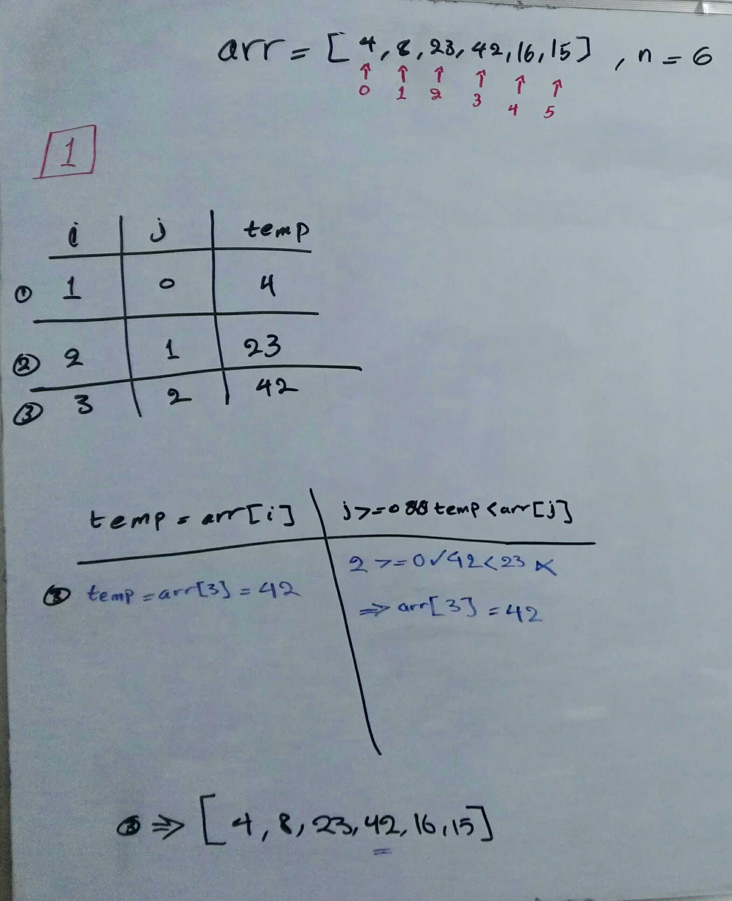
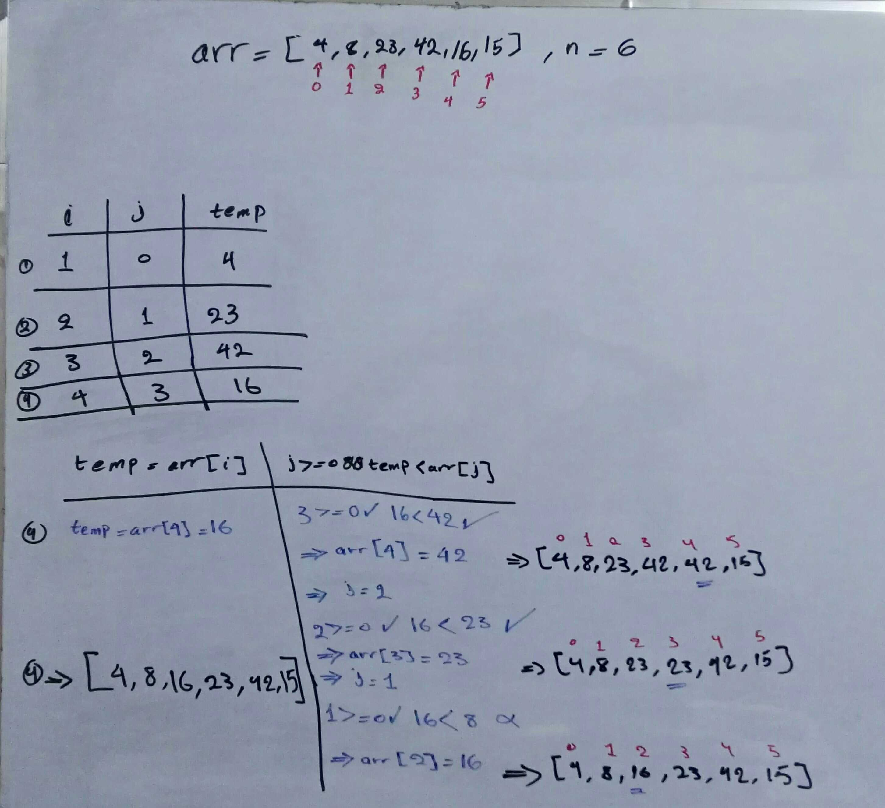

# Insertion Sort

## Challenge Description

Given this psuedocode:
```js
InsertionSort(int[] arr)
  
    FOR i = 1 to arr.length
    
      int j <-- i - 1
      int temp <-- arr[i]
      
      WHILE j >= 0 AND temp < arr[j]
        arr[j + 1] <-- arr[j]
        j <-- j - 1
        
      arr[j + 1] <-- temp
```
- review the pusedocode
- trace the algorithm   
==> stepping through the process with the sample array:   
`[8,4,23,42,16,15]`
- create a blog article that documents your explaination   
==> showing a step-by-step output after each iteration through some sort of visual
- after creating the article  
==> write a working, tested code implementation of Insertion Sort based on the pseudocode

- other sample input (for understanding & testing):
  - Reverse-sorted: `[20,18,12,8,5,-2]`
  - Few uniques: `[5,12,7,5,5,7]`
  - Nearly-sorted: `[2,3,5,7,13,11]`

## Approach & Efficiency

- Provide a visual step through for each of the sample arrays based on the provided pseudo code
- Convert the pseudo-code into working code Javascript
- Present a complete set of working tests

### Big O

- **Time Complexity: O(n^2)**  
   The basic operation of this algorithm is comparison. This will happen  
    `n * (n-1)` number of times, concluding the algorithm to be n squared.
- **Space Complexity: O(1)**  
   No additional space is being created. This array is being sorted in place, keeping the space at constant O(1).

## Whiteboard





