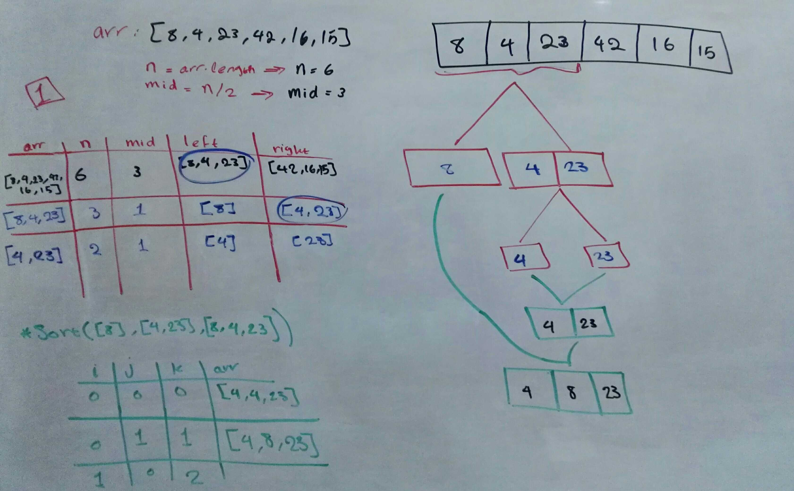
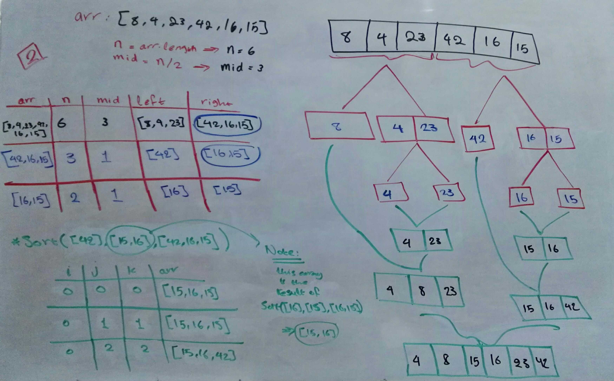

# Merge Sort

## Challenge Description

Given this psuedocode:
```js
ALGORITHM Mergesort(arr)
    DECLARE n <-- arr.length
           
    if n > 1
      DECLARE mid <-- n/2
      DECLARE left <-- arr[0...mid]
      DECLARE right <-- arr[mid...n]
      // sort the left side
      Mergesort(left)
      // sort the right side
      Mergesort(right)
      // merge the sorted left and right sides together
      Merge(left, right, arr)

ALGORITHM Merge(left, right, arr)
    DECLARE i <-- 0
    DECLARE j <-- 0
    DECLARE k <-- 0

    while i < left.length && j < right.length
        if left[i] <= right[j]
            arr[k] <-- left[i]
            i <-- i + 1
        else
            arr[k] <-- right[j]
            j <-- j + 1
            
        k <-- k + 1

    if i = left.length
       set remaining entries in arr to remaining values in right
    else
       set remaining entries in arr to remaining values in left
```
- review the pusedocode
- trace the algorithm   
==> stepping through the process with the sample array:   
`[8,4,23,42,16,15]`
- create a blog article that documents your explaination   
==> showing a step-by-step output after each iteration through some sort of visual
- after creating the article  
==> write a working, tested code implementation of Insertion Sort based on the pseudocode

- other sample input (for understanding & testing):
  - Reverse-sorted: `[20,18,12,8,5,-2]`
  - Few uniques: `[5,12,7,5,5,7]`
  - Nearly-sorted: `[2,3,5,7,13,11]`

## Approach & Efficiency

- Provide a visual step through for each of the sample arrays based on the provided pseudo code
- Convert the pseudo-code into working code Javascript
- Present a complete set of working tests

### Big O

- **Time Complexity: O(nLog(n))**  

- **Space Complexity: O(n)**  


## Whiteboard





