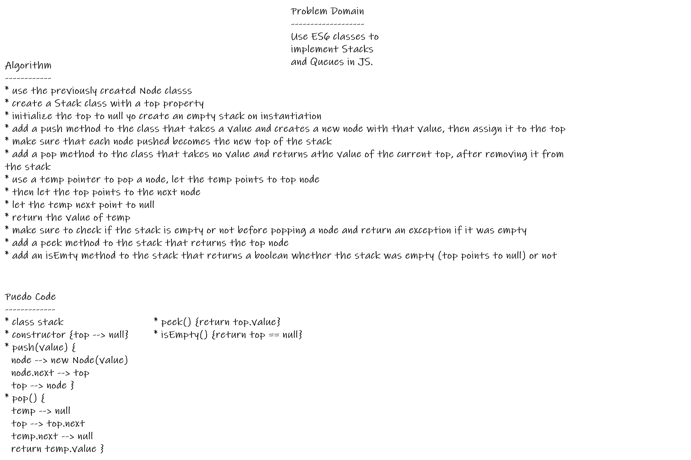
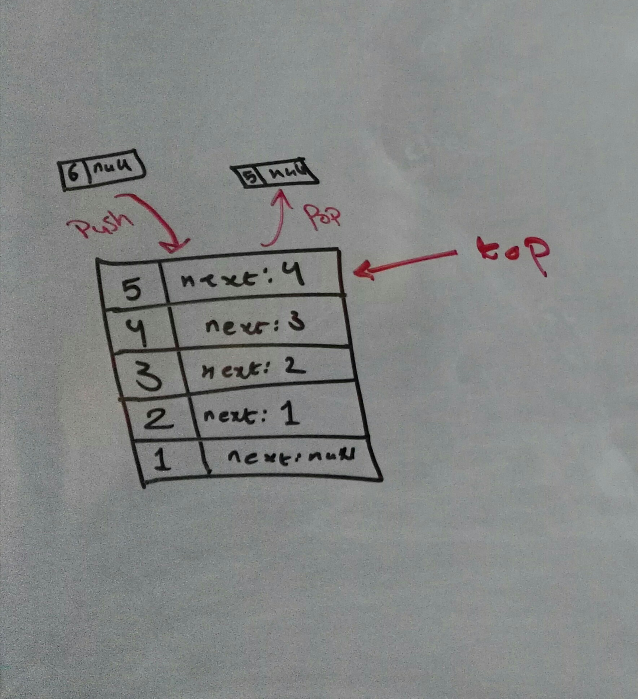
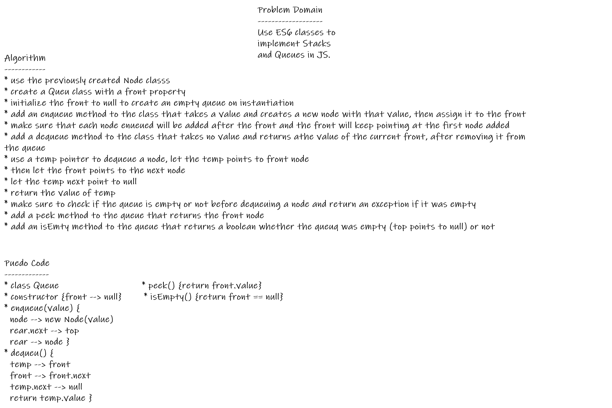
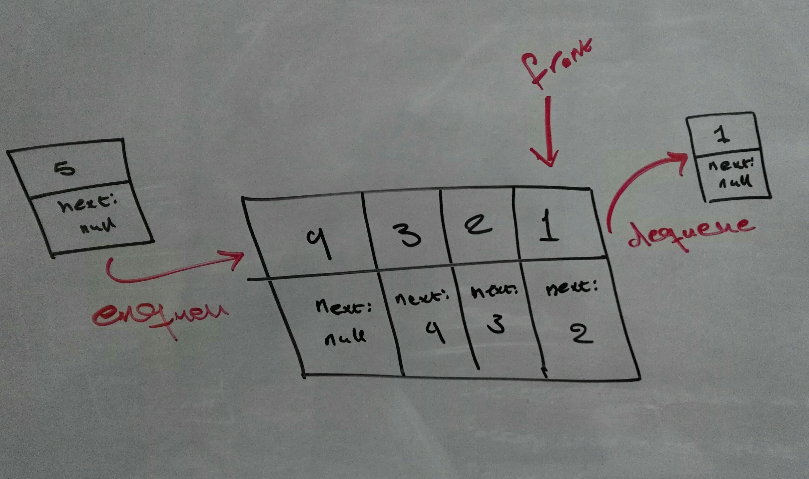

# Stacks Queues Implementation

## Background Summary
- Stacks and Queues are both commonly used data structures that allow us to dynamically store and retrieve data items in two very different ways.  
- A stack is a dynamic data set in which elements use the Last-In-First-Out principle (LIFO) to define data structure. 
- Stack structure limits data in the way that it can only be added to or removed from the top. 

- Queues are implemented using a First-In-Fist-Out (FIFO) principle, meaning that the items are removed from the list in exactly the same order in which they were added to it.    
- Queues can be implemented using arrays or linked lists.

Read more about stacks and queues implementation in JS:
- [Data Structures: Stacks & Queues](https://medium.com/@hitherejoe/data-structures-stacks-queues-a3b3591c8cb0)
- [Stacks and Queues Guide](https://codefellows.github.io/common_curriculum/data_structures_and_algorithms/Code_401/class-10/resources/stacks_and_queues.html)

## Challenge Description 
**JS Stacks & Queues Implementation**  
Create a Stack class and a Queue class and implement the main methods of stacks and Queus.

* Stack methods:
  - `push()`: Pushing a Node onto a stack as a new top (add to end).
  - `pop()`: Popping a Node off a stack as removing from top.
  - `peek()`: inspecting the top Node of the stack.
  - `isEmpty()`: checking if the stack is empty and returining a boolean.

* Queue methods: 
  - `enqueue`: add an item to a queue (add to end).
  - `dequeue`: remove an item from a queue (remove from front). 
  - `peek()`: inspecting the front Node of the queue.
  - `isEmpty()`: checking if the queue is empty and returining a boolean.

## Approach & Efficiency
**Approach**  
- did not use array implementation, but used the node class implementation.
- used conditional statements and a loop (while and if)

**Efficiency: Big O Notation**  
- Time Complexity:
  - O(1) --> for both stacks and queues, and for all their methods
- Space Complexity:
  - O(n) --> for both stacks and queues, and for all their methods

  ## WhiteBoard

